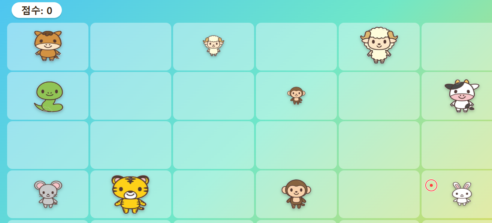

# 동물 과녁 맞추기 게임

> 🔗 **플레이하기**: **https://limdaejin-agent.github.io/target-game/**

어린이 대상, 밝고 재미있는 분위기의 브라우저 과녁 맞추기 게임. 단일 `index.html` 파일로 동작하며 외부 라이브러리·서버가 전혀 없습니다.




## 파일 구성

| 파일 | 설명 |
|---|---|
| `index.html` | 게임 전체 (HTML/CSS/JS 인라인). 기본 동물 이미지 9종·시작음·종료음이 base64로 내장되어 있어 이 파일 하나만 옮겨도 그대로 동작 |
| `PLAN.md` | 최종 기획서 원본 (화면 흐름, 기능 명세, 버그 수정 내역까지 포함) |
| `게임시작화면.png` / `게임화면.png` | 스크린샷 |
| `.gitignore` | OS/에디터 임시 파일 제외 |

## 화면 흐름

```
포인터 선택 화면 ──┬─→ 옵션 화면 (과녁 이미지 / 시작·종료음 / 총소리·파괴음 / 소리 크기 / 마우스 감도)
                  ├─→ 게임 방법 화면 (규칙 설명)
                  └─→ ⚡ 민첩도 테스트 (별도 미니게임, 아래 참고)
        │
        ▼ "놀이 시작!"
   3-2-1-START! 카운트다운
        │
        ▼
   게임 플레이 화면 (30초, 5x7 과녁판, 동시 최대 15개 과녁, 포인터 화면 밖 이탈 방지)
        │
        ▼ (시간 종료 또는 "게임 종료" 버튼)
   결과 화면 (최종 점수 + 순위표 Top10 + 재도전/종료)
```

## 주요 기능

### 게임 플레이
- **5행 x 7열 = 35칸** 그리드, 각 칸이 독립적으로 "대기 → 랜덤 등장 → 자동 소멸 → 재대기" 사이클을 반복하되, 동시 노출은 **최대 15개**로 제한
- 과녁 크기·지속시간·점수가 하나의 공식으로 연동: 작을수록 고득점(최대 100점)·짧은 노출(최소 0.5초), 클수록 저득점·긴 노출
- 좌클릭 명중 시 과녁이 3x3 조각으로 깨지는 효과 + "+점수" 텍스트 애니메이션
- **포인터 락(Pointer Lock) 기반 마우스 감도 조절**: 게임 화면에서 OS 커서를 고정하고, 감도가 곱해진 가상 커서만 화면 안에서 움직이게 해 마우스가 화면 밖으로 나가는 것을 원천 차단

### ⚡ 민첩도 테스트 (미니게임)
- 한 번에 과녁 1개만 랜덤한 칸에 등장, 화살표로 0.45~0.95초 예고 후 최대 0.2초만 노출
- 화살표 예고 중에는 스포트라이트 효과로 해당 칸만 밝게 표시되고, 이 단계에서는 클릭해도 발사되지 않음
- 반응 속도가 빠를수록 고득점, 일반 모드와 별도의 전용 순위표에 기록

### 커스터마이징 (옵션 화면)
- 과녁 이미지 / 시작·종료음 / 총소리·파괴음을 파일 또는 폴더(랜덤 재생) 단위로 지정 가능 → `IndexedDB`에 영구 저장
- 소리 크기(0~100%), 마우스 감도(0.2x~3.0x) 슬라이더 — `localStorage`에 저장되어 다음 실행에도 유지
- 지정하지 않으면 내장 기본 동물 그림 / Web Audio 합성음 사용

## 자료 저장 방식

| 자료 | 저장 위치 | 우선순위 |
|---|---|---|
| 포인터 스타일, 순위표(일반/민첩도 각각) | `localStorage` | - |
| 소리 크기 / 마우스 감도 | `localStorage` | - |
| 사용자 지정 과녁 이미지·효과음 | `IndexedDB` | 1순위 |
| 파일에 내장된 기본 자료 | `index.html` 소스 코드 내부 (base64) | 2순위 |
| 기본 내장 동물 그림 / 합성음 | 인라인 SVG / Web Audio 합성 | 3순위 (최종 fallback) |

## 알려진 제약

- 순위표는 브라우저(로컬)에 저장되므로 다른 기기와 공유되지 않음
- Pointer Lock API 특성상 잠기는 순간 브라우저가 "Esc로 해제" 안내를 짧게 보여줄 수 있음 (정상 동작이며 게임 오류 아님)
- 일부 브라우저/자동화 환경에서는 Pointer Lock 요청이 거부될 수 있으나, 이 경우에도 일반 마우스 추적으로 오류 없이 동작

## 버그 수정 내역

- **과녁 빠른 더블클릭 시 멈추는 현상**: `` 요소의 기본 드래그 가능 속성이 더블클릭을 방해하던 문제 → `draggable=false` + `dragstart`/`mousedown` 기본 동작 차단, CSS `user-drag:none` 계열 속성 추가로 해결

자세한 화면별 명세, 설계 근거, 구현 노트는 [`PLAN.md`](./PLAN.md)를 참고하세요.
